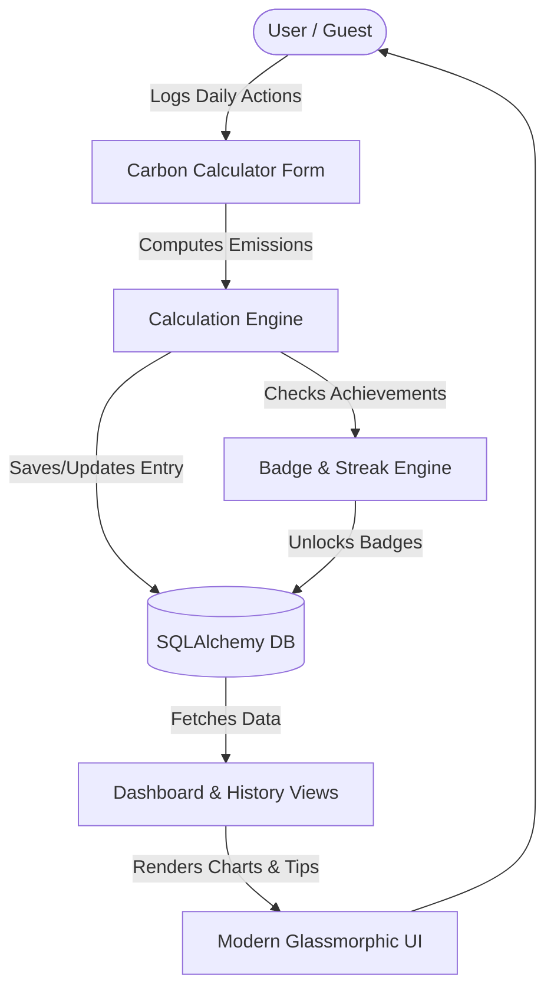

# 🌍 CarbonCredit: The Eco-Ladders Game (India 2026)

[](https://flask.palletsprojects.com/)
[](https://www.sqlalchemy.org/)
[](#-india-2026-data-calibration)
[](#-testing)

Welcome to **CarbonCredit**, a futuristic web application that reimagines the classic Indian childhood game **Snakes and Ladders** (_Moksha Patam_) into a quest for ecological survival in the year 2026. Built entirely on **Flask**, CarbonCredit gamifies daily carbon footprint tracking to help you reduce your environmental footprint, earn badges, and compete with yourself to achieve a net-zero impact.

---

## 🎲 Reimagining Childhood Games for 2026

In **Eco-Ladders & Carbon-Snakes**, your everyday choices determine your position on the path to zero emissions. The goal is to stay below India's daily average footprint of **5.2 kg CO₂e** and climb towards the carbon-neutral zone.

### 🪜 The Ladders (Green Offsets)

Whenever you make a sustainable choice, you climb a **Green Ladder**, immediately reducing your carbon score and boosting your streak:

- 🚴 **Green Transit**: Commuting by metro, train, bicycle, or walking.
- ☀️ **Solar Harvest**: Generating home energy using solar panels (assuming ~4 kWh/day offset in India).
- 🥗 **Plant Power**: Choosing vegan or traditional Indian vegetarian meals.
- ♻️ **Circular Living**: Composting organic waste and recycling plastic/paper.

### 🐍 The Snakes (Carbon Traps)

When high-emission activities catch you off-guard, you slide down a **Carbon Snake**, increasing your daily footprint and jeopardizing your achievements:

- 🚗 **Fossil Commutes**: Travelling solo in single-occupant petrol/diesel cars.
- ✈️ **Frequent Flying**: Domestic and international flights which yield significant emission spikes.
- 🥩 **Heavy Carnivore**: Consuming carbon-heavy meals.
- 🗑️ **Landfill Dump**: Throwing away unsorted waste without recycling or composting.

---

## 🎮 Gameplay Mechanics & Features

| Concept             | Game Element in 2026            | Impact / Points | Carbon Equivalent (kg CO₂e)        |
| :------------------ | :------------------------------ | :-------------: | :--------------------------------- |
| 🪜 **Green Ladder** | Riding Electric Vehicle / Metro |   High Climb    | `0.050` / `0.035` per passenger-km |
| 🪜 **Green Ladder** | Generating Solar Power          |   High Climb    | `-0.716` per kWh offset (CEA)      |
| 🪜 **Green Ladder** | Opting for Vegan/Veg Meals      | Moderate Climb  | `0.45` / `0.72` per meal           |
| 🪜 **Green Ladder** | Circular Waste & Composting     |   Minor Climb   | 70% to 85% emission reduction      |
| 🐍 **Carbon Snake** | Driving Petrol/Diesel Cars      |   Large Slide   | `0.192` / `0.171` per km           |
| 🐍 **Carbon Snake** | Taking Domestic/Intl Flights    |   Huge Slide    | `0.255` / `0.195` per passenger-km |
| 🐍 **Carbon Snake** | Heavy Non-Vegetarian Meals      | Moderate Slide  | `2.38` per meal                    |
| 🐍 **Carbon Snake** | Landfilling Unsorted Waste      |   Minor Slide   | `0.58` per kg                      |

### Key System Features

- 👤 **Instant Guest Play**: Zero hurdles to start. The system automatically provisions a local Guest user profile secure with underlying cryptographic sessions.
- 🧮 **5-Category Multi-step Calculator**: Log transport, home energy, diet, waste, and water consumption.
- 🏆 **Legendary Badges**: Earn achievements like **First Step** 🌱, **Consistency Champion** 🔥 (7-day streak), **Low Carbon Day** 🌿, **Green Commuter** 🚲, and **Eco Warrior** 🛡️.
- 📊 **Visual Dashboard**: Beautiful SVG and canvas charts (powered by Chart.js) visualizing your weekly trends and category breakdowns in a premium dark glassmorphic UI.
- 💡 **Indian Tips Engine**: Actionable suggestions tailored to 2026 Indian context (e.g., solar subsidies, metro routes, local municipal composting).

---

## 🏗️ Architecture & Component Flow



### 📂 Directory Structure

```text
CarbonFootprint/
├── app.py                  # Flask Application Factory
├── run.py                  # WSGI entrypoint for development & HuggingFace
├── config.py               # Development, Testing, and Production Configs
├── models.py               # SQLAlchemy Database Models (User, CarbonEntry, Badge)
├── forms.py                # WTForms validation for calculator and auth
├── routes/                 # Blueprint Route Handlers
│   ├── api.py              # REST API endpoints for charts data
│   ├── calculator.py       # Calculator workflow & results handling
│   └── dashboard.py        # Dashboard visualization & history pages
├── utils/                  # Helper modules and engines
│   ├── badges.py           # Badge criteria & streak calculations
│   ├── calculator_engine.py# Carbon calculation math
│   ├── emission_factors.py # India-specific carbon factors (CEA, IPCC)
│   └── tips_engine.py      # Personalized sustainability advice generator
├── static/                 # Stylesheets, JS components, and charts code
├── templates/              # Jinja2 Layout Templates (Base, Dashboard, Calculator)
└── tests/                  # Automated unit and integration test suite
```

---

## ⚙️ Local Installation & Development Setup

### Prerequisites

- Python 3.10+
- SQLite3

### 1. Clone & Set Up Virtual Environment

```bash
# Clone the repository
git clone https://huggingface.co/spaces/Mr-TD/CarbonFootprint
cd CarbonFootprint

# Create a virtual environment
python -m venv venv

# Activate virtual environment
# On Windows (PowerShell):
.\venv\Scripts\Activate.ps1
# On macOS/Linux:
source venv/bin/activate
```

### 2. Install Dependencies

```bash
pip install -r requirements.txt
```

### 3. Configure Environment Variables

Create a `.env` file in the root directory:

```env
FLASK_ENV=development
SECRET_KEY=dev-secret-key-change-in-production
DATABASE_URL=sqlite:///carboncredit.db
```

### 4. Run the Application

```bash
python run.py
```

Open your browser and navigate to `http://127.0.0.1:7860` or `http://127.0.0.1:5000` to start playing.

---

## 🐳 Running with Docker

You can easily package and run CarbonCredit as a Docker container (aligned with Hugging Face Spaces' deployment environment):

```bash
# Build the image
docker build -t carbon-footprint-game .

# Run the container (exposing port 7860)
docker run -p 7860:7860 carbon-footprint-game
```

---

## 🧪 Testing

The codebase has robust unit and integration coverage using **pytest**.

```bash
# Run the complete test suite
pytest

# Run tests with a coverage report
pytest --cov=.
```

---

## 🇮🇳 India 2026 Data Calibration

Carbon factors are aligned with 2026 projections and verified Indian database baselines:

1.  **Electricity**: Calibration of `0.716 kg CO₂e/kWh` based on the **Central Electricity Authority (CEA)** Baseline Database v20.0 (reflecting India's growing renewable energy share).
2.  **LPG Cylinders**: `42.5 kg CO₂e` per standard 14.2 kg domestic LPG cylinder.
3.  **Dietary Factors**: Calibrated based on Energy Alternatives India (EAI) dietary studies.
4.  **Waste**: Mixed landfill factors set to `0.58 kg CO₂e/kg` following **NITI Aayog** waste sector reports.
5.  **Water**: Municipal water footprint calculated at `0.0003 kg CO₂e/Litre` including purification and distribution pumping grid power.
